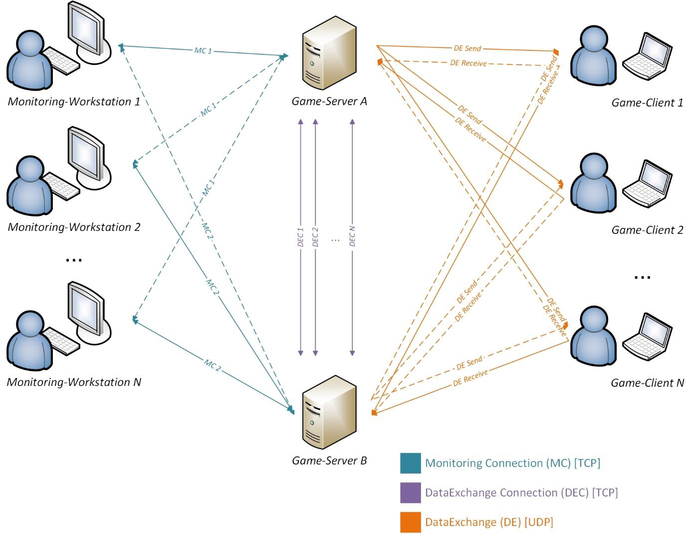
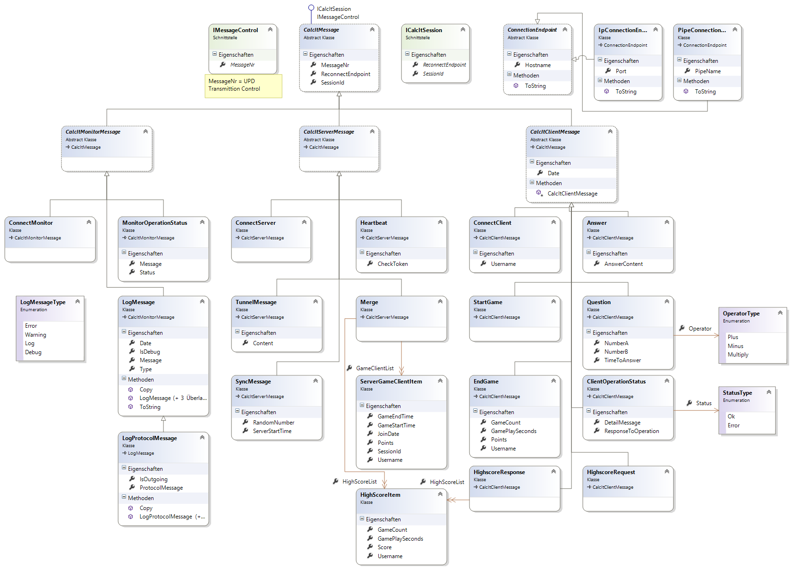

# CalcIt

CalcIt is a simple "math-based" game to demonstrate a distributed server environment with failover capabilities.

## Implementation

## System Architecture

### Messages

---

Projekt für Netzwerk Vorlesung
Mathematisches Spiel in einer verteilten Serverumgebung.

FH Wiener Neustadt 
Master - SAD
